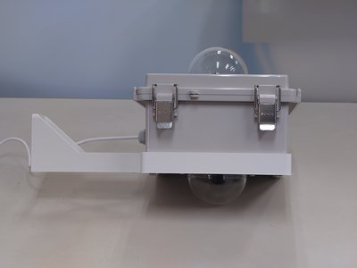
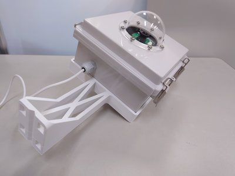

# PiSphere: RaspberryPi 5-based time-lapse camera for 360° images

## Overview
This project is for creating a time-lapse camera that captures 360° images using a RaspberryPi 5.
The camera is designed to be powered by a small solar panel or battery and to operate intermittently using an RTC (Real-Time Clock) to power the device only during shooting times.

  
  

## Hardware Installation
### 1. Hardware Components
- RaspberryPi 5
- [RTC battery pack for Raspberry Pi 5](https://www.raspberrypi.com/products/rtc-battery/)
- 2 x 150 mm CSI cable for RaspberryPi zero and 5
- General heat sink for RaspberryPi 5
- [2 x RaspberryPi HQ Camera (**M12 Mount**)](https://www.raspberrypi.com/products/raspberry-pi-high-quality-camera/)
- [2 x 2.7mm Ultra Wide lens for RaspberryPi HQ Camera](https://www.mouser.jp/ProductDetail/Raspberry-Pi/SC0947?qs=rQFj71Wb1eVOORb%252B17NIKQ%3D%3D)
- [2 x 60 mm Acrylic dome](https://entaniya.shop-pro.jp/?pid=183320529)
- 2 x 60 mm General silicone gasket
- [Waterproof Box BCAP151509G](https://www.takachi-el.co.jp/products/BCAP)
- General USB-C power cable
- General Cable grand
- General M2.5 x 10 mm spacer for RaspberryPi
- Bolts and nuts
  - M3 x 10 mm x 12
  - M3 x 16 mm x 4
  - M4 x 10 mm x 16
- [3D-printed Jigs](https://www.printables.com/model/1104747-pisphere-jigs)

### 2. Assembly
1. **Prepare the RaspberryPi 5:**

   - Attach the heat sink to the RaspberryPi 5.
   - Connect the RTC battery pack to the RaspberryPi 5.

2. **Prepare the Camera Modules:**

   - Connect the 150 mm CSI cable to the RaspberryPi 5 and the camera modules.
   The upper camera module should be connected to the `CAM0` port,
   and the lower camera module should be connected to the `CAM1` port.

3. **Prepare the Waterproof Box:**
   - Print the 3D-printed jigs with ASA filament.
   - Drill holes in the waterproof box to attach the acrylic domes
     and the cable gland.
   - Attach the camera modules to the waterproof box using the 3D-printed jigs
     and M3 x 10mm, M3 x 16 mm bolts and nuts.
   - Attach the acrylic domes to the waterproof box using the M4 x 10 mm
     bolts and nuts. Insert the silicone gaskets between the acrylic domes
     and the waterproof box.
   - Attach the cable gland to the waterproof box.
     Pass the USB-C power cable through the cable gland and
     connect it to the RaspberryPi 5.

## Software Installation
### 1. Setting up your RaspberryPi 5
```
$ uname -a
Linux pisphere 6.12.25+rpt-rpi-2712 #1 SMP PREEMPT Debian 1:6.12.25-1+rpt1 (2025-04-30) aarch64 GNU/Linux
```
I tested `PiSphere` with a RaspberryPi 5 4GB and RaspberryPi OS 64-bit (Bookworm, with desktop env).

The Raspberry Pi 5 can be equipped with an RTC (Real-Time Clock) battery that maintains the time even when the main power is turned off.
`PiSphere` performs intermittent operation using the RTC to power the device only during shooting times,
enabling it to run solely on a small solar panel or battery. To enable this feature, the following steps are required:

1. **Modify the Configuration File:**

   - Append the following line to `/boot/firmware/config.txt` and then reboot the Raspberry Pi:
     ```
     dtparam=rtc_bbat_vchg=3000000
     ```

   - After rebooting, verify that `/sys/devices/platform/soc@107c000000/soc@107c000000\:rpi_rtc/rtc/rtc0/charging_voltage` is set to `3000000`.

2. **Edit the EEPROM Configuration:**

   - Run the following command to edit the EEPROM configuration:
     ```bash
     sudo -E rpi-eeprom-config --edit
     ```

   - Ensure that the following settings are present:
     ```
     POWER_OFF_ON_HALT=1
     WAKE_ON_GPIO=0
     ```

### 2. Install PiSphere software
```bash
sudo apt-get update
sudo apt-get upgrade -y
sudo apt-get install -y git
cd ~
git clone https://github.com/0kam/PiSphere.git
cd PiSphere
chmod +x setup.sh
./setup.sh
```

With running `setup.sh`, you can set up the following:
- The starting and ending time of the time-lapse shooting
- The interval between shots

The script will create a cron job to run the `run.sh` script at the specified time intervals.
In the below example, the script is set to run every 120 minutes between 07:00 and 18:00.
RaspberryPi will turn up at 1 minute before the shooting time and turn off after shooting.
The obtained images will be stored in the `~/Pictures/PiSphereImages/` directory.

```
$pi@raspberrypi:~/PiSphere $ ./setup.sh

        ______   _   ______         _
       (_____ \ (_) / _____)       | |
        _____) ) _ ( (____   ____  | |__   _____   ____  _____
       |  ____/ | | \____ \ |  _ \ |  _ \ | ___ | / ___)| ___ |
       | |      | | _____) )| |_| || | | || ____|| |    | ____|
       |_|      |_|(______/ |  __/ |_| |_||_____)|_|    |_____)
                            |_|


=========================================
   Welcome to the PiSphere Setup Script!
   This script will automate the necessary
   configurations for PiSphere.
   Please follow the prompts and provide
   the required information.
=========================================

[2024-12-11 15:08:00] The script is located in the home directory of user: pi
Please enter the capture start time (HH:MM, 24-hour format, e.g., 07:00):
07:00
Please enter the capture end time (HH:MM, 24-hour format, e.g., 18:00):
18:00
Please enter the capture interval in minutes (e.g., 30):
120
[2024-12-11 15:08:12] User settings - Start Time: 07:00, End Time: 18:00, Interval: 120 minutes
[2024-12-11 15:08:12] The script is being executed for user: pi
[2024-12-11 15:08:12] Run script /home/pi/PiSphere/shs/run.sh already exists. Deleting it.
[2024-12-11 15:08:12] Copied /home/pi/PiSphere/shs/run.sh.template to /home/pi/PiSphere/shs/run.sh
[2024-12-11 15:08:12] Replaced placeholders in /home/pi/PiSphere/shs/run.sh
[2024-12-11 15:08:12] Set execute permission for /home/pi/PiSphere/shs/run.sh
[2024-12-11 15:08:12] Added cron jobs for PiSphere_Run_Script with logging to /home/pi/PiSphere/shs/cron.log.
[2024-12-11 15:08:12] PiSphere setup completed successfully.
Please run the run.sh script once to initialize the capture process:
/home/pi/PiSphere/shs/run.sh
```

Generated cron job:
```
00 07 * * * /home/pi/PiSphere/shs/run.sh >> /home/pi/PiSphere/shs/cron.log 2>&1 # PiSphere_Run_Script
00 09 * * * /home/pi/PiSphere/shs/run.sh >> /home/pi/PiSphere/shs/cron.log 2>&1 # PiSphere_Run_Script
00 11 * * * /home/pi/PiSphere/shs/run.sh >> /home/pi/PiSphere/shs/cron.log 2>&1 # PiSphere_Run_Script
00 13 * * * /home/pi/PiSphere/shs/run.sh >> /home/pi/PiSphere/shs/cron.log 2>&1 # PiSphere_Run_Script
00 15 * * * /home/pi/PiSphere/shs/run.sh >> /home/pi/PiSphere/shs/cron.log 2>&1 # PiSphere_Run_Script
00 17 * * * /home/pi/PiSphere/shs/run.sh >> /home/pi/PiSphere/shs/cron.log 2>&1 # PiSphere_Run_Script
```

## Sample Images
  